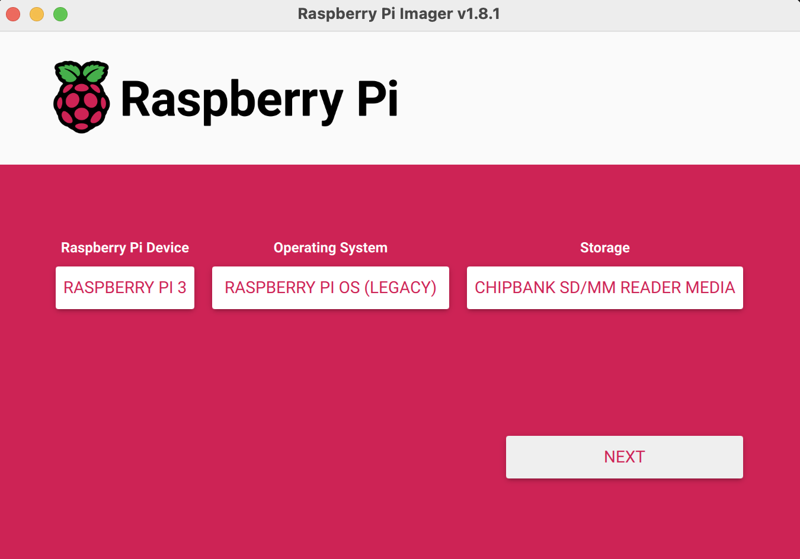
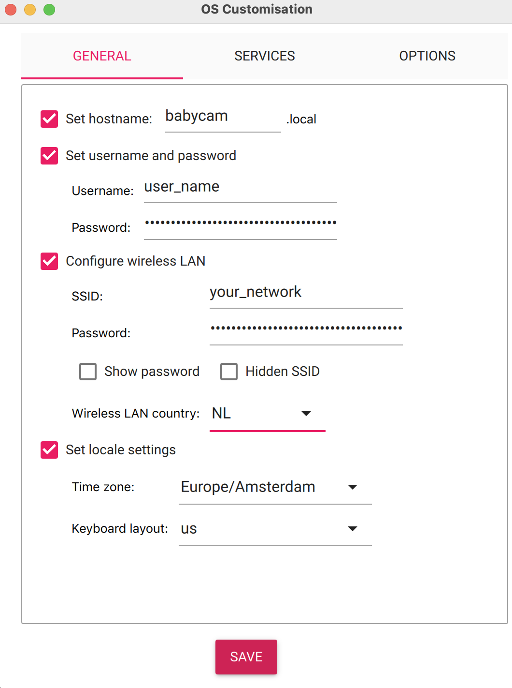
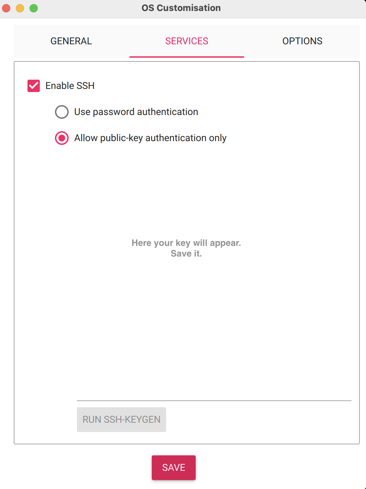

# Introduction to the BabyCam

Welcome to the BabyCam project! At its core, the BabyCam is a testament to the fusion of simplicity and functionality. It's designed for parents who want to create a reliable, yet cost-effective baby monitoring solution. This guide will walk you through the steps to build your own BabyCam, starting from acquiring the necessary components to the final setup and operation.

### What is the BabyCam?

The BabyCam is a custom-built baby monitor, leveraging the RaspberryPi platform. It's an innovative solution for parents who prefer a hands-on approach and enjoy the satisfaction of building their own technology. The BabyCam is not just a gadget; it's an experience in creating something that adds value to your family's life.

This comprehensive guide provides a step-by-step approach to setting up a BabyCam using a RaspberryPi. Starting from the initial setup of the RaspberryPi with the Raspbian Operating System, the guide meticulously covers every aspect needed to build a fully functional and secure baby monitoring system. Key steps include:

1. **RaspberryPi Preparation**: Flashing the Raspbian OS, configuring Wi-Fi connectivity and enabling SSH.
2. **Security Hardening**: Replacing the default 'pi' user with a custom user and other security enhancements.
3. **VNC Server Setup**: Instructions for setting up a virtual desktop for remote access, using either TightVNC or RealVNC.
4. **Audio and Video Configuration**: Detailed steps for checking and setting up video and audio devices.
5. **Streaming Service Setup**: Instructions for installing necessary software like FFmpeg and Nginx, configuring streaming commands, and setting up the streaming service to start at the RaspberryPi's boot.
6. **Nginx Configuration**: Details on modifying the Nginx configuration for streaming, including creating and setting permissions for the HLS directory.

Throughout the guide, focus is maintained on ensuring the system is user-friendly, secure, and reliable, making it suitable for monitoring and ensuring the safety of your baby.


### Why Choose the BabyCam?

1. **Customizable**: Unlike off-the-shelf baby monitors, the BabyCam can be tailored to your specific needs and preferences.
2. **Cost-Effective**: Building your own BabyCam can be more economical than purchasing high-end baby monitors.
3. **Educational**: The process of assembling and setting up the BabyCam provides a great learning experience in basic electronics and programming.
4. **Quality Control**: You oversee the entire creation process, ensuring the quality and reliability of your baby monitor.

### What You Will Need

Before diving into the world of DIY baby monitoring, you will need to gather a few key components. These include:

- **RaspberryPi 3 B+**: The heart of your BabyCam, providing the necessary computing power.
- **Operating System**: Raspbian GNU/Linux 11 (bullseye), optimized for RaspberryPi.
- **MicroSD Card**: A 16+ GB card to store the operating system and necessary software.
- **External PowerBank**: To ensure your BabyCam stays operational, even during power outages.
- **USB Microphone**: For clear audio monitoring.
- **Night Vision Camera SC15-1**: To keep an eye on your baby even in low light conditions.
- **RaspberryPi Camera Module**: For high-quality video monitoring.

This guide will detail every step, from assembling these parts to configuring the software, ensuring that you have a fully functional BabyCam tailored to your needs. Welcome to the exciting journey of building your own baby monitor!

## Using Your Finished RaspberryPi BabyCam

Based on the provided details, here's an adjusted guide on how to operate your BabyCam for optimal usage:

### Starting the BabyCam

1. **Powering Up**:
    - To start using the BabyCam, connect it to the power supply.
    - Position the camera so it has a clear view of the baby’s area.

### Viewing the Live Stream

1. **Accessing the Stream on Mobile or Laptop**:
    - Open a web browser on your mobile phone or laptop.
    - Navigate to the BabyCam stream at: `http://babycam.local/live/stream.m3u8`.
    - This URL directly connects you to the live feed from the BabyCam, letting you monitor your baby in real-time.

### Remote Management Options

1. **SSH Access**:
    - For remote access to the RaspberryPi’s operating system, use SSH.
    - From your host machine, connect via SSH by typing `ssh user_name@babycam.local` in the terminal.
    - Use a secure password when prompted.

2. **VNC Access**:
    - To view and interact with the desktop version of the Raspbian operating system, open your VNC viewer.
    - Connect to `http://babycam.local:5901`.

### Tips for Optimal Use

- **Regular Checks**: Periodically check the camera's positioning and the power connection to ensure continuous operation.
- **Password Security**: As a security best practice, consider changing the default passwords provided in the setup for both SSH and VNC access.
- **Updates and Maintenance**: Regularly update your RaspberryPi and the associated software to ensure the system remains secure and functional.

### Conclusion

With these simple steps, your BabyCam is not just a monitoring tool; it becomes an integrated part of your home, providing peace of mind and security for your baby. The combination of easy access streaming, along with advanced remote management options (not handled in this guide), offers a comprehensive and user-friendly baby monitoring solution.

## Installing the Raspbian Operating System on Your RaspberryPi

The installation of the Raspbian Operating System is a pivotal step in setting up your BabyCam. This process involves downloading the appropriate OS image, flashing it onto your SD card, and configuring initial settings. Here's an improved guide to help you through this process:

### Step-by-Step Installation Guide

1. **Downloading the Raspberry Pi Imager**:
    - Visit the official Raspberry Pi website and download the Raspberry Pi Imager software, specifically the `imager_1.8.1.dmg` file for macOS. 
    - This software is essential for flashing the SD card with the Raspberry Pi OS.
  
2. **Using the Raspberry Pi Imager for OS Installation on SD Card**:
    - Launch the Raspberry Pi Imager and follow these steps:
        1. Select 'Operating System' -> 'Raspberry Pi OS (Other)' -> Choose the relevant Bullseye version.
        2. Edit the settings to enable SSH (preferably with a key), set a password, username, device name, and save the SSH key. This step is crucial for remote access and security.
        3. Choose the correct SD card from the list and click 'Write'.
        4. Refer to the provided images for guidance of how to install the OS:
            - 
            - 
            - 

3. **Finalizing the SD Card**:
    - Safely eject the SD card after the flashing process is complete.
    - Re-insert the SD card into your computer and add two important files to the boot directory:
        - An empty file named `ssh` (without any extension) to enable SSH access.
        - The correctly configured `wpa_supplicant.conf` file for your Wi-Fi settings. See an example in this repo.
        - ``` wpa_supplicant.conf
          country=NL
          ctrl_interface=DIR=/var/run/wpa_supplicant GROUP=netdev
          update_config=1
  
          network={
              # raspberrypi zero w only does 2.4 GHz WiFi and laptop needs to be connected on same WiFi!
              ssid="network_name_1"
              psk="psswd"
              key_mgmt=WPA-PSK
              priority=1
          }
  
          network={
              ssid="network_name_2"
              psk="psswd"
              key_mgmt=WPA-PSK
              priority=2
          }
          ```

4. **Clearing Previous SSH Keys/ Login**:
    - If you have previously connected to a Raspberry Pi device using SSH, it’s advisable to clear the existing SSH keys. This can be done by opening the `~/.ssh/known_hosts` file using `sudo nano ~/.ssh/known_hosts` and removing the corresponding line with `Ctrl + K`.
    - next you can login to the pi via ssh with `ssh user_name@babycam.local` if both the pi and the device you use to login are on the same WiFi (and the pi is capable of connecting to that wifi)

5. **Updating and Upgrading the System**:
    - Once the OS is installed, run the following commands to update and upgrade the system libraries:
      ```shell
      sudo apt update && sudo apt upgrade
      ```

6. **Wi-Fi Compatibility**:
    - Be aware that some Raspberry Pi models might only support 2.4 GHz Wi-Fi networks. It's essential that both your Raspberry Pi and your computer are connected to the same Wi-Fi network for seamless setup and communication.

By following these steps, you'll have a RaspberryPi ready with the latest Raspbian OS, configured for your BabyCam project. This setup ensures that your device is secure, up-to-date, and ready for further customization and use.


## Hardening Your RaspberryPi for Enhanced Security

After setting up your RaspberryPi with the necessary software and configurations for the BabyCam, it's crucial to harden it, enhancing its security to protect against unauthorized access or malicious attacks. Follow these steps to ensure your RaspberryPi is well-secured:

### Preliminary Steps

1. **Check for Default User**:
    - Before proceeding, check if the default 'pi' user still exists. This can be done by listing the users in the system or attempting to login as 'pi'.
    - If the 'pi' user exists, it's advisable to replace it with a custom user for security purposes.

### Hardening Process

1. **Obtain RaspberryPi IP**:
    - Connect to your RaspberryPi and run `ifconfig` to find its IP address. This address is needed for remote SSH access.

2. **Initial SSH Connection**:
    - Connect via SSH using the default credentials: `ssh pi@raspberrypi`.
    - When prompted, type 'yes' to accept the connection and enter the default password `raspberry`.

3. **Create a New User**:
    - Add a new user with enhanced privileges: 
      ```
      sudo useradd [new_username] -s /bin/bash -m -G adm,sudo,audio,video
      ```
    - Replace `[new_username]` with your chosen username (e.g., `user_name`).
    - Check the groups the new user is added to by running `groups`.

4. **Set New User Password**:
    - Set a password for the new user:
      ```
      sudo passwd [new_username]
      ```
    - Follow the prompts to enter and confirm the new password.
    - Switch to the new user with `su - [new_username]`.

5. **Update and Upgrade**:
    - Run the following commands to update the system:
      ```
      sudo apt-get update --fix-missing && sudo apt-get -y upgrade && sudo apt-get -y dist-upgrade
      ```

6. **Configure RaspberryPi Settings**:
    - Run `sudo raspi-config` to access the configuration menu.
    - Modify settings as needed, such as:
      - Changing the hostname (to something like `babycam`).
      - Enabling VNC Server and video options.
      - Setting locale, timezone, and GPU memory allocation (e.g., 256 MB).
    - After making changes, reboot the RaspberryPi with `sudo reboot`.

7. **Connect as New User**:
    - SSH into the RaspberryPi using the new user credentials: `ssh [new_username]@[new_hostname]`.

8. **Remove Default User**:
    - To enhance security, remove the default 'pi' user:
      ```
      sudo userdel pi && sudo rm -rf /home/pi
      ```

9.  **Final Reboot**:
    - Perform a final reboot to apply all changes: `sudo reboot`.
    - Reconnect using SSH: `ssh [new_username]@[new_hostname]`.

By following these steps, you'll have significantly improved the security of your RaspberryPi. This hardening process is vital for any device that will be running continuously, especially one as sensitive as a baby monitor. With these measures in place, your BabyCam is now more secure and ready for reliable operation.


## Accessing RaspberryPi Desktop/ Running VNC Server (Optional)

For a headless setup of your RaspberryPi (where no monitor, keyboard, or mouse is directly connected to the Pi), using a virtual desktop is an efficient way to access and manage the device. A Virtual Network Computing (VNC) server allows you to remotely control your RaspberryPi's desktop environment from another computer or mobile device. Below are two options for setting up and accessing a VNC server on your RaspberryPi.

### Option 1: Using TightVNC

TightVNC is a free and lightweight VNC software, known for its simplicity and effectiveness. Here's how to set it up:

1. **Install Necessary Packages**:
    - Install the XFCE desktop environment, icon themes, and the TightVNC server:
      ```
      sudo apt-get -y install xfce4 xfce4-goodies gnome-icon-theme tightvncserver
      ```
    - Additionally, install a web browser (Iceweasel):
      ```
      sudo apt-get -y install iceweasel
      ```

2. **Set VNC Password**:
    - Run `vncpasswd` and enter a secure password when prompted (e.g., `babycam3666`).

3. **Start VNC Server**:
    - Start the VNC server with the command:
      ```
      vncserver :1
      ```
    - This command starts a VNC session on display number 1.

4. **Stopping the VNC Server**:
    - To stop the VNC server, use:
      ```
      vncserver -kill :1
      ```

5. **Connecting to the VNC Server**:
    - To find out the IP address of your RaspberryPi, type `ifconfig` and note the IP address listed under "inet".
    - On your VNC viewer (installed on another computer), connect to the RaspberryPi by typing either `ip-address:5901` or `babycam:5901`.

### Option 2: Using RealVNC from RaspberryPi Configuration

RealVNC offers a more integrated solution for RaspberryPi and supports a wider range of features.

1. **Enable VNC Server Service**:
    - Start and enable the RealVNC server service:
      ```
      systemctl start vncserver-virtuald.service && systemctl enable vncserver-virtuald.service
      ```
    - This will ensure that the VNC server starts automatically at boot.

2. **Accessing via RealVNC Viewer**:
    - Install the RealVNC Viewer on another computer or mobile device.
    - Connect to your RaspberryPi using its IP address or hostname followed by the port number, similar to the TightVNC method.

By setting up a VNC server on your RaspberryPi, you can efficiently manage your BabyCam system remotely, making it easier to adjust settings, update software, or troubleshoot issues without needing direct physical access to the RaspberryPi. Both TightVNC and RealVNC provide robust solutions for accessing your RaspberryPi's desktop remotely.


## The Programming Part: Setting Up Video and Audio Streaming on RaspberryPi

In this section, we'll delve into the programming aspects necessary for setting up a video and audio streaming service using your RaspberryPi. This involves checking video and audio device compatibility, installing necessary software like Nginx and FFmpeg, configuring the streaming command, and ensuring the service starts automatically at RaspberryPi boot.

### Checking Video and Audio Devices

1. **Install Video and Audio Utilities**:
   - Update your RaspberryPi and install utilities to check video and audio devices:
     ```
     sudo apt-get update
     sudo apt-get install v4l-utils
     ```

2. **List Video Devices**:
   - Use `v4l2-ctl --list-devices` to list connected video devices.
   - Check specific device settings with `v4l2-ctl --device=/dev/video0 --all`.

3. **Check Audio Devices**:
   - List audio recording devices with `arecord -l`.
   - Test recording audio with `arecord -D hw:2,0 -r 44100 -c 1 -f S16_LE test.wav`.
   - To dump hardware parameters, use `arecord --dump-hw-params -D hw:2,0 /dev/null`.

### Installing Nginx and FFmpeg

1. **Install FFmpeg and Nginx**:
   - Run the following command to install both FFmpeg and Nginx:
     ```
     sudo apt-get install ffmpeg nginx
     ```

2. **Start and Enable Nginx Service**:
   - Start the Nginx service and enable it to start at boot:
     ```
     sudo systemctl start nginx
     sudo systemctl enable nginx
     ```

### Configuring Streaming Service

1. **Create Streaming Script**:
   - Create a script named `start_stream.sh` in the `/home/user_name` directory:
     ```
     sudo nano /home/user_name/start_stream.sh
     ```
   - Add the following content to the script. To build this command use the commands and output from "Checking Video and Audio Devices" and ask chatGPT to adjust the following command for your system as well as explain the different parts of the command:
     ```bash
     #!/bin/bash
     /usr/bin/ffmpeg -f v4l2 -thread_queue_size 1000 -i /dev/video0 -f alsa -ac 1 -thread_queue_size 1000 -i hw:2,0 -c:v libx264 -preset ultrafast -tune zerolatency -g 30 -b:v 800k -c:a aac -b:a 96k -ar 44100 -f hls -hls_time 1 -hls_list_size 5 -hls_flags delete_segments -hls_allow_cache 0 /var/www/html/live/stream.m3u8 > /home/user_name/ffmpeg.log 2>&1
     ```

2. **Create HLS Directory**:
   - Create a directory for HLS (HTTP Live Streaming) files and set the correct access rights:
     ```
     sudo mkdir /var/www/html/live/
     sudo chown -R user_name:user_name /var/www/html/live/
     sudo chmod -R 755 /var/www/html/live/
     ```

### Configuring Nginx for Streaming

1. **Edit Nginx Configuration**:
   - Modify the Nginx configuration file:
     ```
     sudo nano /etc/nginx/nginx.conf
     ```
   - ... to look like:
     ``` nginx
     #user  user_name;
     worker_processes  1;
 
     #error_log  logs/error.log;
     #error_log  logs/error.log  notice;
     #error_log  logs/error.log  info;
 
     pid        /run/nginx.pid;
 
     events {
         worker_connections  1024;
     }
 
     http {
         include       mime.types;
         default_type  application/octet-stream;
 
         log_format  main  '$remote_addr - $remote_user [$time_local] "$request" '
                         '$status $body_bytes_sent "$http_referer" '
                         '"$http_user_agent" "$http_x_forwarded_for"';
 
         access_log  /var/log/nginx/access.log  main;
 
         sendfile        on;
         #tcp_nopush     on;
 
         keepalive_timeout  65;
 
         #gzip  on;
 
         server {
             listen       80;
             server_name  localhost;
 
             #charset koi8-r;
 
             #access_log  logs/host.access.log  main;
 
             location / {
                 root   /usr/share/nginx/html;
                 index  index.html index.htm;
             }
 
             # HLS configurations
             location /live {
                 types {
                     application/vnd.apple.mpegurl m3u8;
                     video/mp2t ts;
                 }
                 root /var/www/html; # The directory where HLS files are stored
                 add_header Cache-Control no-cache; # Prevent caching of HLS files
                 add_header Access-Control-Allow-Origin *; # Allow web players to access the HLS files
             }
 
             #error_page  404              /404.html;
 
             # redirect server error pages to the static page /50x.html
             #
             error_page   500 502 503 504  /50x.html;
             location = /50x.html {
                 root   /usr/share/nginx/html;
             }
 
             # proxy the PHP scripts to Apache listening on 127.0.0.1:80
             #
             #location ~ \.php$ {
             #    proxy_pass   http://127.0.0.1;
             #}
 
             # pass the PHP scripts to FastCGI server listening on 127.0.0.1:9000
             #
             #location ~ \.php$ {
             #    root           html;
             #    fastcgi_pass   127.0.0.1:9000;
             #    fastcgi_index  index.php;
             #    fastcgi_param  SCRIPT_FILENAME  /scripts$fastcgi_script_name;
             #    include        fastcgi_params;
             #}
 
             # deny access to .htaccess files, if Apache's document root
             # concurs with nginx's one
             #
             #location ~ /\.ht {
             #    deny  all;
             #}
         }
 
         # another virtual host using mix of IP-, name-, and port-based configuration
         #
         #server {
         #    listen       8000;
         #    listen       somename:8080;
         #    server_name  somename  alias  another.alias;
 
         #    location / {
         #        root   html;
         #        index  index.html index.htm;
         #    }
         #}
 
         # HTTPS server
         #
         #server {
         #    listen       443 ssl;
         #    server_name  localhost;
 
         #    ssl_certificate      cert.pem;
         #    ssl_certificate_key  cert.key;
 
         #    ssl_session_cache    shared:SSL:1m;
         #    ssl_session_timeout  5m;
 
         #    ssl_ciphers  HIGH:!aNULL:!MD5;
         #    ssl_prefer_server_ciphers  on;
 
         #    location / {
         #        root   html;
         #        index  index.html index.htm;
         #    }
         #}
     }
     ```
   - Include the HLS configuration in the `server` block as shown in the provided `nginx.conf` file.

2. **Restart Nginx**:
   - After editing the configuration, restart Nginx to apply the changes:
     ```
     sudo systemctl enable nginx
     sudo systemctl restart nginx
     ```

### Setting Up Streaming Service at Startup

1. **Create Systemd Service**:
   - Create a systemd service file for your streaming script:
     ```
     sudo nano /etc/systemd/system/stream.service
     ```
   - Add the following content to the file:
     ```ini
     [Unit]
     Description=Start Stream at Boot
     After=network-online.target
     Wants=network-online.target

     [Service]
     ExecStartPre=/bin/sleep 30
     ExecStart=/home/user_name/start_stream.sh
     User=user_name
     Restart=on-failure

     [Install]
     WantedBy=multi-user.target
     ```

2. **Enable and Start the Streaming Service**:
   - Enable the service to start at boot and start the service:
     ```
     sudo systemctl enable stream.service
     sudo systemctl start stream.service
     ```

3. **Check Services**:
   - `sudo systemctl status stream.service`
   - `sudo systemctl status nginx`
   - if both commands show status enable and running, then all looks good.

By following these steps, you will have successfully set up a live streaming service on your RaspberryPi, which starts automatically upon boot. This setup allows you to stream both video and audio from your RaspberryPi, making it an ideal solution for a DIY BabyCam or any similar project. The ffmpeg command is a very versatile command which can adjust all camera and audio settings for potential other use cases.

## Configuring Firewall with UFW on the BabyCam RaspberryPi

For enhanced security, it's important to configure a firewall on your RaspberryPi BabyCam. We'll use UFW (Uncomplicated Firewall) for this purpose. This firewall will help control the traffic to only essential services, namely your BabyCam stream and VNC access.

### Installation and Initial Setup

1. **Install UFW**:
   - If UFW is not already installed, update your RaspberryPi and install it:
     ```bash
     sudo apt-get update
     sudo apt-get install ufw
     ```

2. **Set Default Policies**:
   - Set UFW to deny all incoming connections by default but allow all outgoing connections:
     ```bash
     sudo ufw default deny incoming
     sudo ufw default allow outgoing
     ```

### Configuring Rules for BabyCam

1. **Allow SSH Access**:
   - To maintain remote management capabilities, allow SSH:
     ```bash
     sudo ufw allow ssh
     ```

2. **Allow BabyCam Stream**:
   - Your BabyCam stream is accessible at `http://babycam.local/live/stream.m3u8`. Generally, this requires HTTP access (port 80):
     ```bash
     sudo ufw allow 80/tcp
     ```

3. **Allow VNC Access**:
   - To access the RaspberryPi desktop remotely, allow VNC on port 5901:
     ```bash
     sudo ufw allow 5901/tcp
     ```

### Enabling the Firewall

- After configuring the rules, enable UFW:
  ```bash
  sudo ufw enable
  ```
- You can verify the status and rules with:
  ```bash
  sudo ufw status verbose
  ```

### Important Notes

- Ensure that you have allowed SSH (port 22) before enabling the firewall to maintain remote access.
- Be cautious when setting rules. Incorrect configuration might lock you out of your RaspberryPi.
- The rules are immediately active upon enabling UFW.
- Regularly check and update firewall rules as per your BabyCam's evolving requirements.

By following these steps, you've added an extra layer of security to your BabyCam, ensuring that only necessary traffic is allowed, and minimizing potential vulnerabilities. This setup keeps the BabyCam's stream and remote management capabilities accessible while protecting the system from unwanted access.


## Accessing the BabyCam Stream from Different Browsers and Devices

The BabyCam stream is designed to be accessible across various devices and browsers, ensuring that you can monitor your baby from anywhere. This chapter guides you through accessing the BabyCam stream using common browsers and devices.

### Accessing from Web Browsers

The BabyCam stream can be accessed from any standard web browser, such as Google Chrome, Mozilla Firefox, Microsoft Edge, or Safari. Here's how:

1. **Open Your Web Browser**:
   - Launch the browser on your laptop or desktop computer.

2. **Enter the BabyCam URL**:
   - Type `http://babycam.local/live/stream.m3u8` in the browser's address bar.

3. **View the Stream**:
   - The live stream from your BabyCam should now be visible. If the stream does not load, ensure your device is connected to the same network as the BabyCam.

### Accessing from Mobile Devices

You can also view the BabyCam stream on mobile devices like smartphones and tablets.

1. **Open a Web Browser on Your Mobile Device**:
   - Use any browser available on your device.

2. **Enter the BabyCam URL**:
   - Just like on a desktop, enter `http://babycam.local/live/stream.m3u8` in the browser's address bar.

3. **Watch the Stream**:
   - Your BabyCam's live feed should appear. Ensure that your mobile device is connected to the same Wi-Fi network as the BabyCam for accessibility.

### Accessing from Smart TVs or Streaming Devices

If your Smart TV or streaming device has a web browser or a compatible streaming application, you can access the BabyCam stream as follows:

1. **Open the Web Browser or Application**:
   - Use the browser or a compatible application on your Smart TV or streaming device.

2. **Navigate to the BabyCam URL**:
   - Enter the URL `http://babycam.local/live/stream.m3u8`.

3. **Viewing on TV**:
   - The live feed from the BabyCam should now be displayed on your TV.

### Enhanced Access to the BabyCam Stream: Mobile Networks and Browser Extensions

To expand the accessibility of your BabyCam stream, especially when you're not connected to your home Wi-Fi, you can configure your RaspberryPi to connect to mobile phone networks. Additionally, for optimal streaming in certain browsers like Google Chrome, you may need to install specific extensions.

#### Connecting RaspberryPi to Mobile Phone Networks

If you're away from home and want your RaspberryPi to connect to a mobile hotspot, you can add the mobile network details to the `wpa_supplicant.conf` file. Here's how:

1. **Edit the `wpa_supplicant.conf` File**:
   - Access your RaspberryPi via SSH and open the `wpa_supplicant.conf` file for editing:
     ```bash
     sudo nano /etc/wpa_supplicant/wpa_supplicant.conf
     ```

2. **Add Mobile Hotspot Details**:
   - Add the configuration for your mobile hotspot to the file. For example:
     ```conf
     network={
         ssid="Your_Mobile_Hotspot_Name"
         psk="Your_Hotspot_Password"
         key_mgmt=WPA-PSK
     }
     ```
   - Replace `"Your_Mobile_Hotspot_Name"` and `"Your_Hotspot_Password"` with your actual hotspot name and password.

3. **Save and Reconnect**:
   - Save the file (Ctrl+O, then Enter) and exit (Ctrl+X).
   - Reboot the RaspberryPi to apply the changes:
     ```bash
     sudo reboot
     ```

#### Accessing the Stream in Google Chrome

For users accessing the BabyCam stream via Google Chrome, an additional step might be necessary:

1. **Install the Play HLS Extension**:
   - In Google Chrome, some streams, especially those in HLS format, may require an additional extension to play smoothly.
   - Install the "Play HLS" extension from the Chrome Web Store. This extension enables Chrome to handle HLS video streams more efficiently.

2. **Accessing the Stream**:
   - After installing the extension, navigate to `http://babycam.local/live/stream.m3u8` in Google Chrome.
   - The stream should now load and play without issues.


### Tips for Seamless Access

- **Network Consistency**: Ensure that the device you are using to view the stream is on the same network as the BabyCam.
- **Browser Compatibility**: While most modern browsers should work, if you encounter issues, try a different browser to see if it resolves the problem.
- **URL Accuracy**: Double-check the URL for typos. The address must be exactly as provided: `http://babycam.local/live/stream.m3u8`.
- **Refresh the Stream**: If the stream seems frozen or unresponsive, try refreshing the page in your browser.

By following these steps, you can keep an eye on your baby from virtually any device, giving you peace of mind whether you're in another room or away from home. The versatility in accessing the stream ensures you're always just a few clicks away from seeing your baby.


### Conclusion

The BabyCam project is an exemplary instance of how technology can be leveraged creatively and efficiently for tasks like baby monitoring. This DIY approach not only provides a cost-effective alternative to commercial baby monitors but also offers a customizable, secure, and educational experience in setting up your own tech solution. By following this guide, users can build a BabyCam tailored to their specific needs, gaining valuable skills in RaspberryPi setup, software installation, and system security along the way. With the BabyCam, you have more than just a monitoring device; you have a project that intertwines technology with the care and safety of your family.